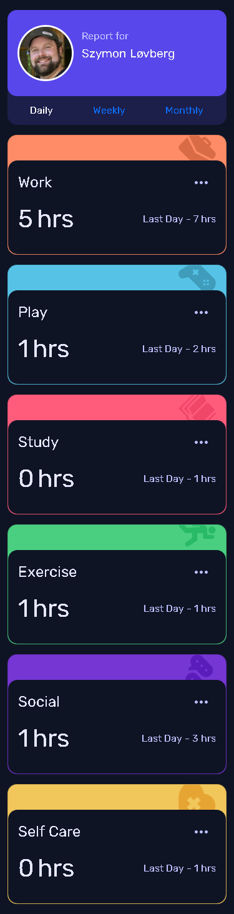
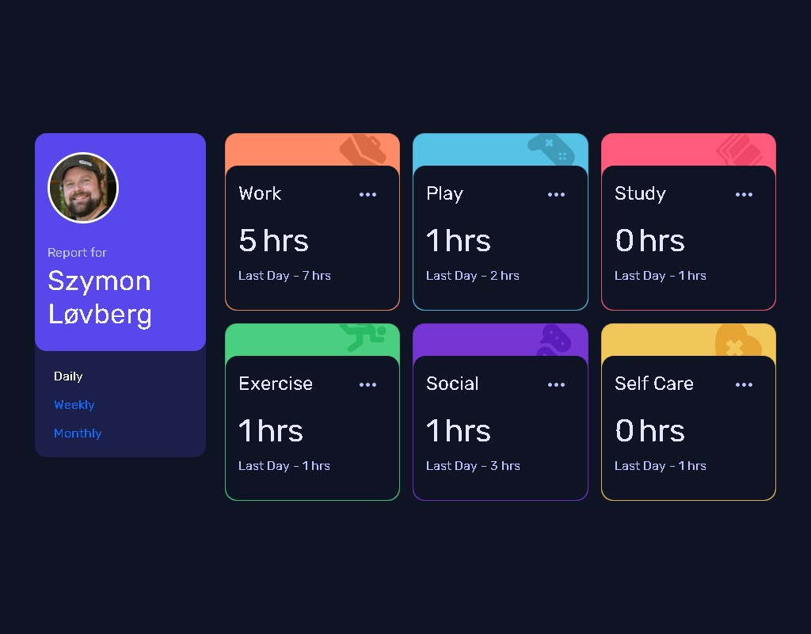

# Frontend Mentor - Time tracking dashboard solution

This is a solution to the [Time tracking dashboard challenge on Frontend Mentor](https://www.frontendmentor.io/challenges/time-tracking-dashboard-UIQ7167Jw). Frontend Mentor challenges help you improve your coding skills by building realistic projects. 

## Table of contents

- [Overview](#overview)
  - [The challenge](#the-challenge)
  - [Screenshot](#screenshot)
  - [Links](#links)
  - [Built with](#built-with)
  - [Useful resources](#useful-resources)
- [Author](#author)

## Overview

### The challenge

Users should be able to:

- View the optimal layout for the site depending on their device's screen size
- See hover states for all interactive elements on the page
- Switch between viewing Daily, Weekly, and Monthly stats

### Screenshot

### Links

- Solution URL: [Click here](https://www.frontendmentor.io/solutions/random-user-api-bootstrap-5-vanilla-javascript-ZDzJpknOB)
- Live Site URL: [Click here](https://hatwell-jonel.github.io/frontendmentor-time-tracking-dashboard/)

### Built with

- Bootstrap 5
- Random user API
- Semantic HTML5 markup
- CSS
- Mobile-first workflow
- JavaScript

### Useful resources

- [Random user API](https://randomuser.me/) - This helped me to generate random user.

## Author

- LinkedIn - [Jonel Haatwell](https://www.linkedin.com/in/jonel-hatwell/)
- Frontend Mentor - [@hatwell-jonel](https://www.frontendmentor.io/profile/hatwell-jonel)

